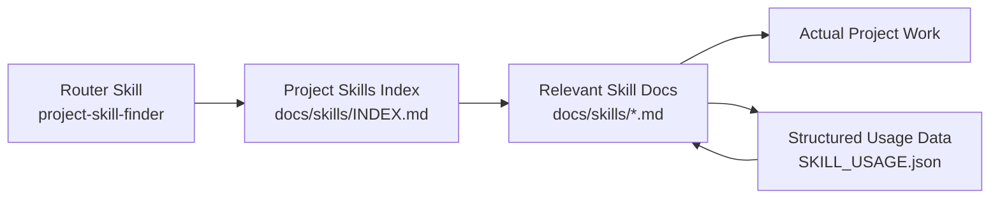
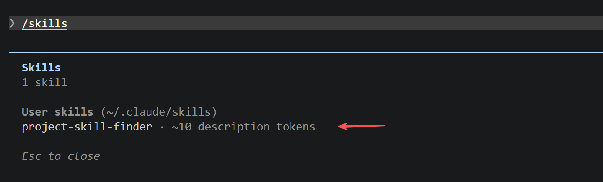
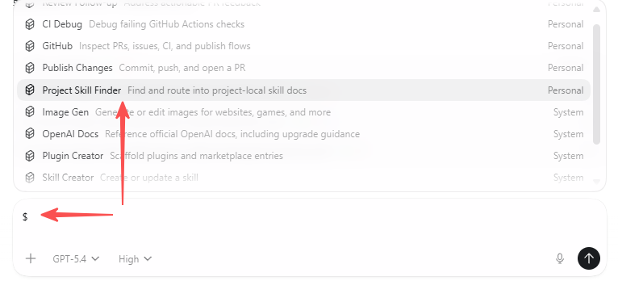
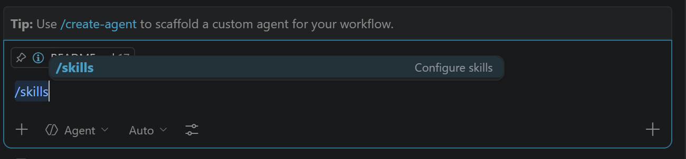
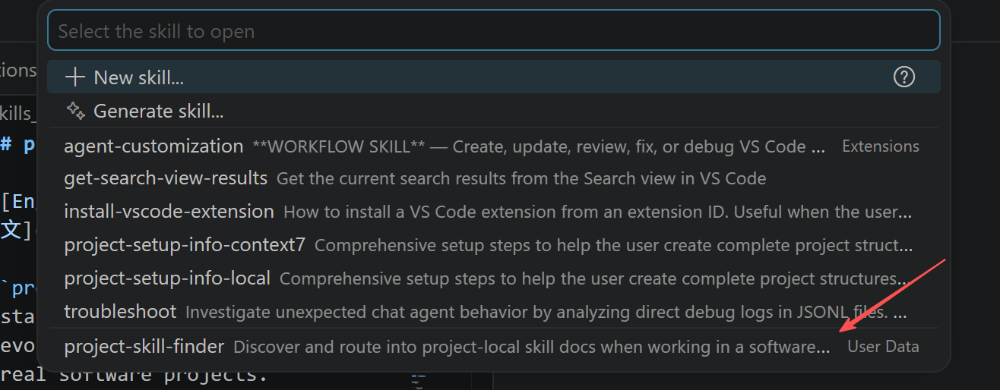

# project_skills_finder

[English](./README.md) | [简体中文](./README.zh-CN.md)

`project_skills_finder` is a starter pattern for building an evolvable AI skills layer inside real software projects.

It separates three concerns:

1. A thin global router skill discovers project-local skill docs
2. The project keeps its own knowledge in versioned `docs/skills/` or `skills/`
3. Usage tracking feeds back into the docs over time

## Repository layout

This subproject is organized for both maintainers and end users:

- `core/project-skill-finder/`
  - shared skill source used across agents
- `adapters/`
  - agent-specific metadata or companion files
- `dist/`
  - ready-to-copy install layouts for each agent
- `build_dist.py`
  - regenerates `dist/` from `core/` plus `adapters/`

End users should copy from `dist/`. Maintainers should edit `core/` and `adapters/`, then rebuild `dist/`.

`dist/` is intentionally runtime-only. It does not include the project doc templates. Use `core/project-skill-finder/templates/` when you want starter files for `docs/skills/`.

## Agent-specific config choices

- Codex:
  - keeps the shared `SKILL.md`
  - adds `agents/openai.yaml`
  - explicitly enables implicit invocation in adapter metadata
- Claude Code:
  - keeps the shared `SKILL.md`
  - hides the router from the slash menu with `user-invocable: false`
- GitHub Copilot:
  - keeps the shared `SKILL.md`
  - adds `license: MIT`
  - ships an optional `.github/copilot-instructions.md` when adding the skill at the project level

By default, Claude Code and Copilot do not pre-approve broad shell access for this router skill. Since it can trigger on many repository tasks, enabling `allowed-tools` too broadly would be riskier than it is helpful in the default distribution.

## Install for each agent

### Codex

Copy:

```text
dist/codex/.agents/skills/project-skill-finder/
```

into your Codex skills location, for example:

- repo-level: `.agents/skills/project-skill-finder`
- user-level: `~/.agents/skills/project-skill-finder`
or
- user-level: `~/.codex/skills/project-skill-finder`

### Claude Code

Copy:

```text
dist/claude/.claude/skills/project-skill-finder/
```

into:

- project-level: `.claude/skills/project-skill-finder`
- user-level: `~/.claude/skills/project-skill-finder`

### GitHub Copilot

Copy:

```text
dist/copilot/.github/skills/project-skill-finder/
```

into :

- For project skills, specific to a single repository, create and use a .github/skills, .claude/skills, or .agents/skills directory in your repository. 

- For user-level skills, shared across projects, create and use a ~/.copilot/skills, ~/.claude/skills, or ~/.agents/skills directory in your home directory.

If you also want the optional repository-wide hint file, copy:

```text
dist/copilot/.github/copilot-instructions.md
```

into `.github/copilot-instructions.md`.

## How it works



The global skill does not carry project knowledge itself. It only helps the agent discover project-local docs, load the minimum relevant ones, and keep a lightweight usefulness signal over time.

- Skill in Claude Code

- Skill in Codex

- Skill in GitHub Copilot



## Core skill contents

The shared core skill contains:

- `SKILL.md`
  - host-neutral routing instructions
- `scripts/update_skill_usage.ps1`
  - PowerShell updater for Windows or PowerShell-first environments
- `scripts/update_skill_usage.sh`
  - shell updater for macOS, Linux, or WSL
- `scripts/update_skill_usage.py`
  - optional fallback implementation for Python-based environments
- `scripts/sync_skill_usage_report.*`
  - dedicated tools that regenerate `SKILL_USAGE.md` from `SKILL_USAGE.json`

## Project-local files

In a project, the skill expects something like:

```text
docs/
  skills/
    INDEX.md
    SKILL_USAGE.json
    SKILL_USAGE.md
    rendering.md
    ssh-runtime.md
```

The project-local docs remain the source of truth. The global router only helps an agent discover and use them.

## Index and skill doc templates

`INDEX.md` should be maintained by the project team. It works best as a dual-track file:

Find the starter templates under:

- `core/project-skill-finder/templates/docs/skills/`

- a machine-friendly YAML routing block
- a short human-friendly table

Recommended `INDEX.md` template:

````md
# Project Skills Index

## Routing Index

```yaml
skills:
  - id: rendering-system
    file: rendering.md
    title: Rendering System Skill
    purpose: Navigate rendering entrypoints, refresh flow, and key tests.
    when_to_use:
      - debugging rendering regressions
      - changing refresh behavior
    keywords:
      - render
      - refresh
      - repaint
    priority: high
```

## Human Index

| Skill ID | Skill | Purpose | When to use | Keywords |
|---|---|---|---|---|
| `rendering-system` | [rendering](./rendering.md) | Navigate rendering entrypoints, refresh flow, and key tests | Debugging rendering regressions or changing refresh behavior | `render`, `refresh`, `repaint` |
````

Recommended project skill doc template:

````md
---
id: rendering-system
title: Rendering System Skill
description: Helps the agent navigate rendering entrypoints, refresh flow, and key tests.
purpose: Navigate rendering entrypoints, refresh flow, and key tests.
when_to_use:
  - debugging rendering regressions
  - changing refresh behavior
keywords:
  - render
  - refresh
  - repaint
owner_area: rendering
---

# Rendering System Skill

## What this area owns

Describe the module or problem area in one or two lines.

## Read these first

- `src/rendering/index.ts`
- `src/rendering/refresh.ts`
- `test/rendering.test.ts`

## Task map

- Use this doc first when the task mentions rendering behavior directly
- Use a different doc if the problem is mainly outside the rendering area
````

The key idea is to keep routing metadata visible in `INDEX.md`, while keeping the full module knowledge inside each skill doc.

## Usage tracking

`SKILL_USAGE.json` is the structured source of truth.

`SKILL_USAGE.md` is the human-readable report regenerated from the JSON data.

The default tracking fields are:

- `skill_id`
- `file`
- `used_count`
- `helpful_count`
- `not_useful_count`
- `not_useful_reasons`
- `last_used_at`
- `notes`

Recommended `not_useful_reasons` labels:

- `description_unclear`
- `wrong_trigger`
- `outdated_content`
- `missing_key_files`
- `too_shallow`
- `too_broad`
- `poor_examples`

## Rebuild dist

After editing `core/` or `adapters/`, rebuild the installable outputs:

```bash
./project_skills_finder/build_dist.sh
```

On Windows, you can also run:

```powershell
.\project_skills_finder\build_dist.ps1
```

## Extend to another agent

To support another Agent tool:

1. Reuse `core/project-skill-finder/`
2. Add a new adapter under `adapters/<tool>/`
3. Teach `build_dist.py` how to emit the install layout into `dist/<tool>/`

This keeps the shared skill logic in one place while letting each agent keep its own install path and host-specific metadata.
