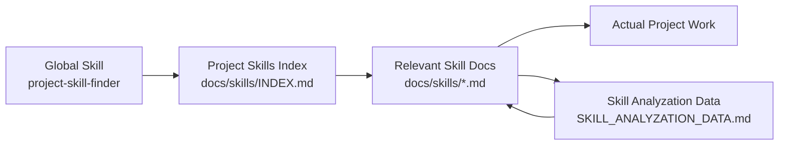

# project_skills_finder

[English](./README.md) | [简体中文](./README.zh-CN.md)

`project_skills_finder` is a starter pattern for building an evolvable AI skills layer inside real software projects.

It separates three concerns:

1. A global Agent skill discovers project-local skill docs
2. The project keeps its own knowledge in versioned `docs/skills/`
3. The project tracks which skill docs are actually useful over time

## Why this exists

This pattern is useful when project knowledge keeps getting repeated in chat, but you do not want to solve that by stuffing more and more project detail into global skills or memory.

The idea is simple:

- keep the global skill thin
- keep project knowledge inside the project
- keep a lightweight feedback loop on what is actually helping

## How it works



The global skill does not carry project knowledge itself. It only helps the agent discover project-local docs, load the minimum relevant ones, and keep a lightweight usefulness signal over time.

## What this subproject contains

- `project-skill-finder/`
  - the actual global Codex skill
- `templates/docs/skills/INDEX.md`
  - a starter index for project-local skill docs
- `templates/docs/skills/SKILL_ANALYZATION_DATA.md`
  - a starter usage-tracking table
- `templates/docs/skills/EXAMPLE_MODULE_SKILL.md`
  - an example project-local skill doc

## Install the global skill

Copy `project-skill-finder/` into your Codex skills directory:

- Windows: `C:\Users\<you>\.codex\skills\project-skill-finder`
- macOS / Linux: `~/.codex/skills/project-skill-finder`

## Add project-local skills

In your project, create:

```text
docs/
  skills/
    INDEX.md
    SKILL_ANALYZATION_DATA.md
    <module>.md
```

The global skill will look for project-local docs in this order:

1. `docs/skills/INDEX.md`
2. `docs/skills/*.md`
3. `skills/INDEX.md`
4. `skills/*.md`

## Quick start

1. Start with one or two project skill docs
2. Add an `INDEX.md` as the main entry
3. Let the global skill route into those docs
4. Track usage in `SKILL_ANALYZATION_DATA.md`
5. Refine, split, or remove project skill docs based on real usage`r`n6. If a task changes the same problem area covered by a project skill doc, review whether that doc should be refreshed

## Suggested project structure

```text
docs/
  skills/
    INDEX.md
    SKILL_ANALYZATION_DATA.md
    command-system.md
    ssh-runtime.md
    rendering.md
```

## Tracking fields

The default tracking table uses:

- `used_count`
- `helpful_count`
- `not_useful_count`
- `not_useful_reasons`
- `last_used_at`
- `notes`

Recommended `not_useful_reasons` labels:

- `description_unclear`
- `wrong_trigger`
- `outdated_content`
- `missing_key_files`
- `too_shallow`
- `too_broad`
- `poor_examples`

## Why not just use memory

Memory is useful for preferences and long-lived collaboration context.

This pattern is for something different: project knowledge that should be versioned with the repo, shared across collaborators, and improved through repeated use.

## Notes

- This repo is a pattern and starter kit, not a heavy framework.
- The global skill should stay small.
- Project-local docs should remain the source of truth.

