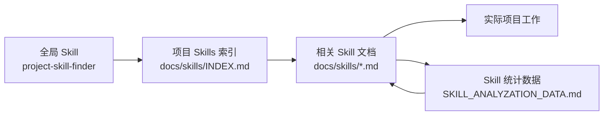

# project_skills_finder

[English](./README.md) | [简体中文](./README.zh-CN.md)

`project_skills_finder` 是一个用于在真实软件项目中构建“可演进 AI Skills 层”的起始模式。

它把三件事拆开处理：

1. 一个全局 Codex skill 用来发现项目内的 skill 文档
2. 项目自己的知识保存在版本化的 `docs/skills/` 中
3. 项目持续记录哪些 skill 文档真正有帮助

## 为什么要做这个

当项目知识不断在对话里重复出现时，很多人第一反应是继续往全局 skill 或 memory 里塞内容。

这个模式的思路不一样：

- 让全局 skill 保持轻量
- 让项目知识留在项目里
- 给 skill 的实际效果保留一层轻量反馈

## 它怎么工作



全局 skill 自己不存项目知识，它只负责帮助 agent 找到项目内 skill 文档、按需加载最相关的内容，并在长期使用中积累轻量效果反馈。

## 这个子项目包含什么

- `project-skill-finder/`
  - 真正可安装的全局 Codex skill
- `templates/docs/skills/INDEX.md`
  - 项目内 skill 文档的起始索引
- `templates/docs/skills/SKILL_ANALYZATION_DATA.md`
  - 使用效果统计表模板
- `templates/docs/skills/EXAMPLE_MODULE_SKILL.md`
  - 一个项目内模块 skill 示例

## 安装全局 skill

把 `project-skill-finder/` 复制到你的 Codex skills 目录：

- Windows: `C:\Users\<you>\.codex\skills\project-skill-finder`
- macOS / Linux: `~/.codex/skills/project-skill-finder`

## 添加项目内 skills

在你的项目里建立：

```text
docs/
  skills/
    INDEX.md
    SKILL_ANALYZATION_DATA.md
    <module>.md
```

全局 skill 会按下面顺序查找：

1. `docs/skills/INDEX.md`
2. `docs/skills/*.md`
3. `skills/INDEX.md`
4. `skills/*.md`

## 快速开始

1. 先写 1-2 份项目 skill 文档
2. 增加一个 `INDEX.md` 作为总入口
3. 让全局 skill 把任务路由到这些文档
4. 在 `SKILL_ANALYZATION_DATA.md` 里记录使用效果
5. 根据真实使用情况继续拆分、合并或优化文档

## 推荐项目结构

```text
docs/
  skills/
    INDEX.md
    SKILL_ANALYZATION_DATA.md
    command-system.md
    ssh-runtime.md
    rendering.md
```

## 统计字段

默认统计表包含：

- `used_count`
- `helpful_count`
- `not_useful_count`
- `not_useful_reasons`
- `last_used_at`
- `notes`

推荐的 `not_useful_reasons` 标签：

- `description_unclear`
- `wrong_trigger`
- `outdated_content`
- `missing_key_files`
- `too_shallow`
- `too_broad`
- `poor_examples`

## 为什么不只用 memory

memory 更适合记录偏好、协作习惯和一些长期上下文。

这个模式解决的是另一类问题：那些应该跟随仓库版本演进、能被团队共享、也能通过反复使用持续优化的项目知识。

## Notes

- 这不是一个重型框架，而是一套模式和 starter kit
- 全局 skill 应该尽量保持轻量
- 项目内文档应始终作为真正的知识来源
