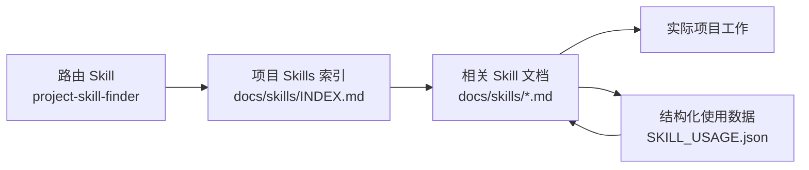

# project_skills_finder

[English](./README.md) | [简体中文](./README.zh-CN.md)

`project_skills_finder` 是一个用于在真实软件项目中构建“可演进 AI Skills 层”的起始模式。

它把三件事拆开处理：

1. 一个轻量的全局路由 skill 负责发现项目内 skill 文档
2. 项目自己的知识保存在版本化的 `docs/skills/` 或 `skills/` 中
3. 使用反馈持续回流到文档体系里

## 仓库结构

这个子项目同时面向维护者和最终使用者：

- `core/project-skill-finder/`
  - 三家 agent 共用的 skill 核心
- `adapters/`
  - 各 agent 自己的元数据或配套文件
- `dist/`
  - 给最终用户直接复制的安装目录
- `build_dist.py`
  - 根据 `core/` 和 `adapters/` 重新生成 `dist/`

最终用户应该直接从 `dist/` 安装。维护者则修改 `core/` 和 `adapters/`，然后重新构建 `dist/`。

## 各 Agent 的配置选择

- Codex：
  - 沿用共享的 `SKILL.md`
  - 额外增加 `agents/openai.yaml`
  - 在适配层里显式开启 implicit invocation
- Claude Code：
  - 使用自己的适配版 `SKILL.md`
  - 通过 `user-invocable: false` 隐藏 slash 菜单入口
- GitHub Copilot：
  - 使用自己的适配版 `SKILL.md`
  - 增加 `license: MIT`
  - 额外提供可选的 `.github/copilot-instructions.md`

默认情况下，Claude Code 和 Copilot 都不会为这个 router skill 预先放开宽泛的 shell 权限。因为它可能在很多仓库任务里自动触发，直接打开 `allowed-tools` 会让默认分发版本过于宽松。

## 各 Agent 的安装方式

### Codex

复制：

```text
dist/codex/.agents/skills/project-skill-finder/
```

到 Codex 的技能目录，例如：

- 仓库级：`.agents/skills/project-skill-finder`
- 用户级：`~/.agents/skills/project-skill-finder`

### Claude Code

复制：

```text
dist/claude/.claude/skills/project-skill-finder/
```

到：

- 项目级：`.claude/skills/project-skill-finder`
- 用户级：`~/.claude/skills/project-skill-finder`

### GitHub Copilot

复制：

```text
dist/copilot/.github/skills/project-skill-finder/
```

到仓库中的：

- `.github/skills/project-skill-finder`

如果还想配套使用仓库级提示文件，也可以复制：

```text
dist/copilot/.github/copilot-instructions.md
```

到 `.github/copilot-instructions.md`。

## 它怎么工作



全局 skill 自己不存项目知识，它只负责帮助 agent 找到项目内 skill 文档、按需加载最相关的内容，并在长期使用中积累轻量效果反馈。

## Core skill 里有什么

共享核心 skill 包含：

- `SKILL.md`
  - 宿主无关的路由说明
- `templates/docs/skills/`
  - 项目内 skill 的起始模板
- `scripts/update_skill_usage.ps1`
  - 面向 Windows 或 PowerShell 环境的 usage 更新脚本
- `scripts/update_skill_usage.sh`
  - 面向 macOS、Linux、WSL 的 shell 脚本
- `scripts/update_skill_usage.py`
  - 面向 Python 环境的可选备用实现
- `scripts/sync_skill_usage_report.*`
  - 专门用于把 `SKILL_USAGE.json` 渲染成 `SKILL_USAGE.md` 的同步工具

## 项目内文件结构

在具体项目里，这套 skill 期望看到类似结构：

```text
docs/
  skills/
    INDEX.md
    SKILL_USAGE.json
    SKILL_USAGE.md
    rendering.md
    ssh-runtime.md
```

项目内文档始终是知识真源。全局路由 skill 只负责帮助 agent 发现和使用这些文档。

## Usage 统计

`SKILL_USAGE.json` 是结构化真源。

`SKILL_USAGE.md` 是从 JSON 数据重新生成的人类可读报表。

默认统计字段包括：

- `skill_id`
- `file`
- `used_count`
- `helpful_count`
- `not_useful_count`
- `not_useful_reasons`
- `last_used_at`
- `notes`

推荐的 `not_useful_reasons` 标签：

- `description_unclear`
- `wrong_trigger`
- `outdated_content`
- `missing_key_files`
- `too_shallow`
- `too_broad`
- `poor_examples`

## 重新生成 dist

修改完 `core/` 或 `adapters/` 后，运行：

```bash
./project_skills_finder/build_dist.sh
```

在 Windows 上，也可以运行：

```powershell
.\project_skills_finder\build_dist.ps1
```

## 扩展到其他 Agent

如果你想支持新的工具：

1. 复用 `core/project-skill-finder/`
2. 在 `adapters/<tool>/` 下增加该工具自己的适配文件
3. 在 `build_dist.py` 里补上新的输出目录 `dist/<tool>/`

这样共享逻辑只维护一份，而每个 agent 仍然可以保留自己的安装路径和宿主特性。
